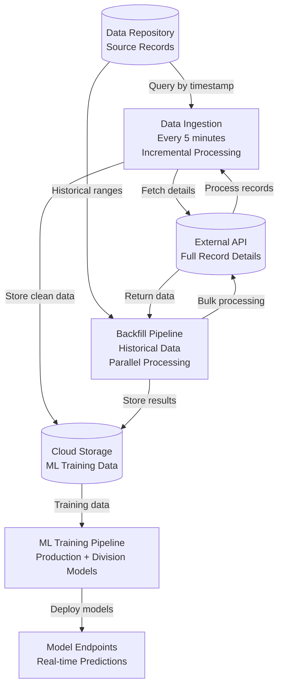

# ML Opportunity Prediction System

## Project Overview

A complete end-to-end machine learning pipeline for **opportunity prediction**, featuring real-time data ingestion, automated ML training with intelligent data rebalancing, and model deployment on Azure.

This system predicts whether a company should pursue a project opportunity based on historical data, project characteristics, and customer information, achieving 87% accuracy with an AUC of 0.74.

## Key Features

- **Real-time Data Ingestion**: Automated data collection every 5 minutes
- **Intelligent ML Pipeline**: Neural network models (MLP architecture) with automated training
- **Division-Specific Models**: Specialized models for different business segments
- **Data Rebalancing**: Automatic handling of imbalanced datasets
- **Azure ML Integration**: Cloud-based training and deployment
- **CI/CD Pipeline**: Fully automated deployment pipeline

## System Architecture



## Technical Stack

- **Language**: Python 3.9+
- **ML Framework**: PyTorch
- **Cloud Platform**: Microsoft Azure
  - Azure Functions (serverless compute)
  - Azure ML (model training/deployment)
  - Azure Table Storage (data persistence)
  - Azure Cognitive Search (data indexing)
- **ML Tracking**: MLflow
- **CI/CD**: Azure DevOps Pipelines

## Project Structure

```
ml-opportunity-prediction/
├── train_production.py              # Main production training script
├── shared/                          # Shared utilities
│   ├── graphdb.py                   # External API client with Base64 decoding
│   └── common.py                    # Data preparation & utilities
├── scripts/                         # ML training & deployment
│   ├── ml_training_utils.py         # Core ML functions & models
│   ├── submit_production_job.py     # Azure ML job submission
│   ├── deploy_endpoint.py           # Model deployment
│   ├── register_model.py            # Model registration
│   └── validate_model_metrics.py    # Model validation gate
├── configs/                         # Configuration files
│   └── production_config.json       # Production model config
├── requirements.txt                 # Core dependencies
├── requirements_production.txt      # ML training dependencies
└── .env.example                     # Environment configuration template
```

## Getting Started

### Prerequisites

- Python 3.9 or higher
- Azure subscription (for cloud deployment)
- Git

### Local Setup

1. **Clone the repository**
   ```bash
   git clone https://github.com/yourusername/ml-opportunity-prediction.git
   cd ml-opportunity-prediction
   ```

2. **Create virtual environment**
   ```bash
   python -m venv .venv
   .venv\Scripts\activate  # Windows
   # or
   source .venv/bin/activate  # Linux/Mac
   ```

3. **Install dependencies**
   ```bash
   pip install -r requirements.txt
   pip install -r requirements_production.txt  # For ML training
   ```

4. **Configure environment variables**
   - Copy `.env.example` to `.env`
   - Fill in your Azure credentials and service endpoints
   - See [Configuration](#configuration) section for details

5. **Test training locally**
   ```bash
   python train_production.py --data-path ./data/sample_data.csv
   ```

### Configuration

Create a `.env` file or set these environment variables:

```bash
# Azure ML Configuration (for cloud training)
AZURE_SUBSCRIPTION_ID=your-subscription-id
AZURE_RESOURCE_GROUP=your-resource-group
AZURE_WORKSPACE_NAME=your-workspace-name
COMPUTE_CLUSTER_NAME=your-compute-cluster
ENVIRONMENT_NAME=your-ml-environment

# Data Storage (if using cloud data source)
DATA_READ_FUNCTION_URL=https://your-data-api.azurewebsites.net
DATA_READ_KEY=your-api-key

# Local Training (alternative to cloud)
DATA_PATH=./data/training_data.csv
```

See `.env.example` for a complete list of configuration options.

## ML Model Architecture

### Production Model (MLP)

The system uses a **Multi-Layer Perceptron (MLP)** architecture optimized for tabular data:

- **Architecture**: Wide & shallow (384 hidden units, 1 layer)
- **Input**: 15 engineered features
- **Output**: Binary classification (pursue/decline)
- **Performance**: 87% accuracy, 0.74 AUC
- **Training**: 5-fold cross-validation with early stopping

### Features (15 total)

1. **Temporal**: Date received (days since reference)
2. **Project**: Size (square feet), duplicate flag
3. **Customer VIP Flags** (6 features):
   - Blacklisted
   - Hotel VIP
   - Large Project VIP
   - Key Customer VIP
   - Historical VIP
   - Historical VIP Rating
4. **Market Segments** (6 features):
   - Education
   - Entertainment/Transit
   - Hospitality/Retail/Dialysis
   - Healthcare
   - Spaces
   - Unknown

### Division-Specific Models

The system trains 8 specialized models:
- 1 general model (all data)
- 7 division-specific models (by business segment)

Each division model uses the same architecture but is trained on segment-specific data.

## Data Pipeline

The system includes utilities for data preparation and feature engineering:

### Data Preparation (`shared/common.py`)

- **Feature Extraction**: Converts raw records into ML-ready features
- **Data Cleaning**: Filters non-human-reviewed records
- **Timestamp Normalization**: Days since reference date (2020-01-01)
- **One-hot Encoding**: Segments and categorical features
- **VIP Feature Parsing**: Extracts customer importance flags

### ID Decoding (`shared/graphdb.py`)

Solves Base64 encoding challenges with variable-length terminators:
- Multi-attempt decoding algorithm
- UTF-16 LE encoding support
- Robust error handling

## Deployment Pipeline

Automated deployment workflow:

1. **Train**: Submit ML training job to Azure ML
2. **Validate**: Check model meets performance thresholds
3. **Register**: Register model in Azure ML registry
4. **Deploy**: Deploy to managed online endpoint

See `scripts/validate_model_metrics.py` for validation gate implementation.

## Performance Metrics

| Metric | Production Model | Target |
|--------|-----------------|--------|
| Accuracy | 86.98% | ≥ 85% |
| AUC | 0.7381 | ≥ 0.65 |
| Precision | 0.80+ | ≥ 0.80 |
| Recall | 0.70+ | ≥ 0.70 |

## Usage

### Training a Model

```bash
# Train production model locally
python train_production.py --data-path ./data/training_data.csv

# Submit to Azure ML
python scripts/submit_production_job.py

# Train division-specific models
python scripts/train_division_models.py --all
```

### Deploying Models

```bash
# Deploy general model
python scripts/deploy_endpoint.py

# Deploy division models
python scripts/deploy_division_endpoints.py
```

### Making Predictions

Once deployed, send POST requests to the prediction endpoint:

```python
import requests
import json

url = "https://your-endpoint.azurewebsites.net/score"
headers = {"Content-Type": "application/json"}

data = {
    "datereceived": 1825,
    "isduplicate": 0,
    "projectSizeSquareFeet": 5000,
    "Blacklisted": 0,
    "HotelVip": 1,
    # ... other features
}

response = requests.post(url, headers=headers, json=data)
prediction = response.json()
print(f"Opportunity probability: {prediction['probability']}")
```

## Model Optimization

The production model was selected through Bayesian hyperparameter optimization:

- **Method**: Tree-structured Parzen Estimator (TPE)
- **Tool**: Optuna framework
- **Trials**: 170 configurations tested
- **Runtime**: 5.1 hours on GPU
- **Efficiency**: 52.9% trials pruned early
- **Result**: MLP architecture significantly outperformed LSTM/GRU for tabular data

## Contributing

We welcome contributions! Please see [CONTRIBUTING.md](CONTRIBUTING.md) for guidelines.

## License

This project is licensed under the MIT License - see the [LICENSE](LICENSE) file for details.

## Security

For security concerns, please review our [SECURITY.md](SECURITY.md) policy.

## Acknowledgments

- Built with Azure cloud services
- ML framework: PyTorch
- Optimization: Optuna
- Tracking: MLflow

## Architecture Details

For detailed architecture documentation, see [ARCHITECTURE.md](ARCHITECTURE.md).

## Contact

For questions or support, please open an issue on GitHub.

---

**Status**: Production Ready
**Last Updated**: January 2025
